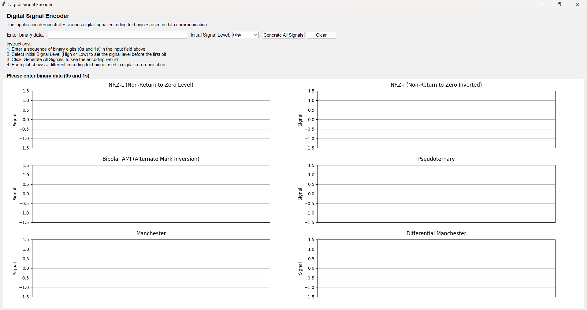
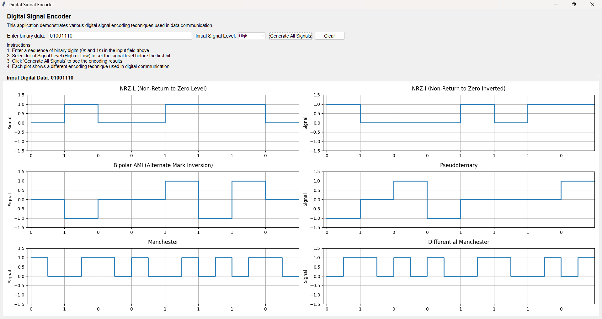

# Digital Signal Encoder
A Python-based GUI application for visualizing different digital signal encoding techniques commonly used in data communication systems.

## Overview
This application allows users to input binary data (0s and 1s) and see how it would be encoded using various line coding schemes. It's a useful tool for understanding digital communication concepts and signal encoding methods.

## Features
- Interactive GUI with input validation
- Visualizes 6 different encoding techniques:
  - NRZ-L (Non-Return to Zero Level)
  - NRZ-I (Non-Return to Zero Inverted)
  - Bipolar AMI (Alternate Mark Inversion)
  - Pseudoternary
  - Manchester
  - Differential Manchester
- Initial Level selection for proper signal encoding
- Real-time signal visualization
- Clear and reset functionality
- Grid-based signal display

## Encoding Rules
- NRZ-L (Non-Return to Zero Level):
  - 0 = low level
  - 1 = high level
- NRZ-I (Non-Return to Zero Inverted):
  - 0 = no transition at the beginning of interval
  - 1 = transition at the beginning of interval
- Bipolar AMI (Alternate Mark Inversion):
  - 0 = no line signal
  - 1 = positive or negative level, with successive 1's alternated
- Pseudoternary:
  - 0 = positive or negative level with successive 0's alternated
  - 1 = no line signal
- Manchester:
  - 0 = transition from high to low at the center of an interval
  - 1 = transition from low to high at the center of an interval
- Differential Manchester:
  - 0 = transition at the beginning of an interval
  - 1 = no transition at the beginning of an interval
  - Always has transition at the center of an interval

## Prerequisites
- Python 3.x
- Required libraries:
  ```bash
  pip install tkinter matplotlib numpy
  ```
  
## Usage
1. Clone the repository
2. Run the application:
  ```bash
  python digital_signal_encoder.py
  ```
3. Enter binary data (e.g., 01001110)
4. Select Initial Level (High or Low)
5. Click 'Generate All Signals' to view the encodings
6. Use 'Clear' to reset

## Screenshots


